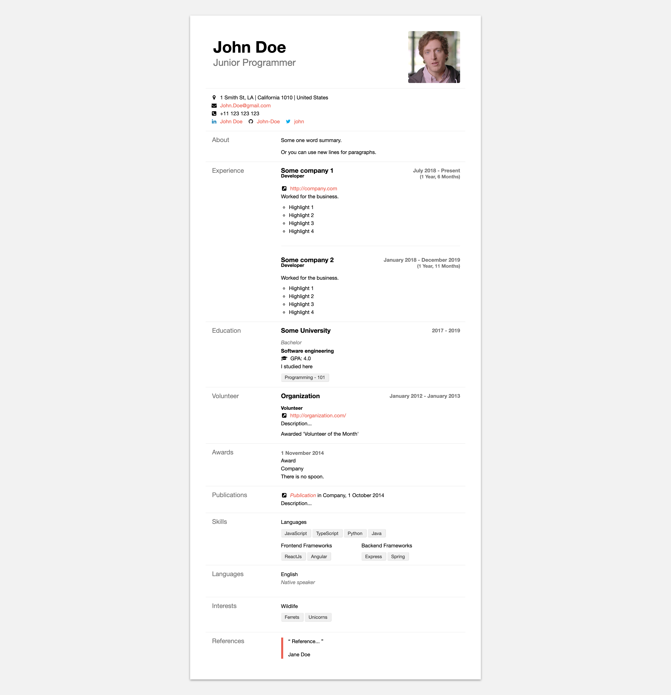
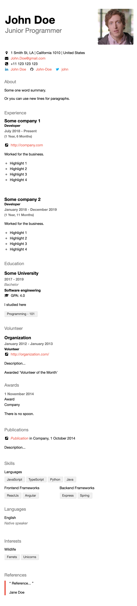

# Spartan theme for jsonresume 

Forked from [jsonresume-theme-spartan](https://www.npmjs.com/package/jsonresume-theme-spartan) by Francesco Esposito

This is an extended version of the json resume theme spartan. There was a couple things I didn't like about the original theme and wanted it to support some custom fields in the resume too.

Things i changed:

- Contact details

  - Made address format better for australian addresses
  - Made country code automatically resolve to long country name

- About

  - Fixed up some paragraph separation issues with new lines
  - Updated some styling

- Experience

  - Updated the formating of Job tittles and employment dates
  - Updated handling of current job status to display "Present"
  - Automatic calculation of employment length
  - Styling for employment highlights

- Education

  - Im proved handling of present education

- Skills

  - Added optional summary line for skill

## Examples

|                       HTML Full                       |                     HTML Mobile                     |
| :---------------------------------------------------: | :-------------------------------------------------: |
|  |  |
